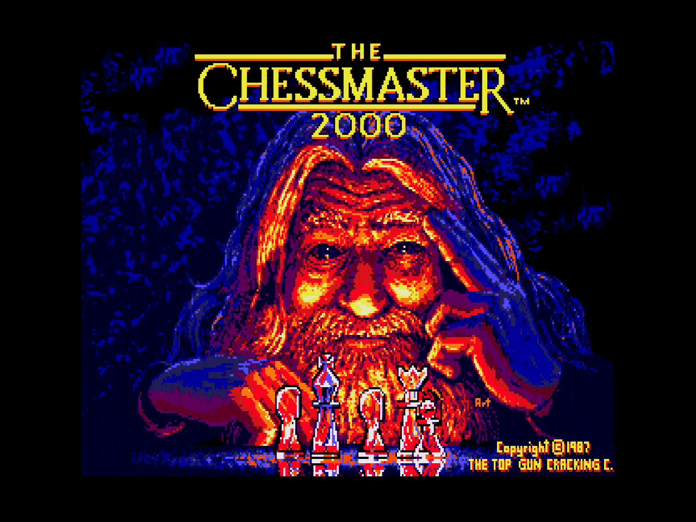

# ChessMaster

## Table of content

* [About](#aboutl)
* [Dynamic](#features)
* [Mechanic](#mechanic)
* [Elements](#elements)
* [Developer contact](#contact)

	
## About
a board game of strategic skill for two players, played on a chequered board on which each playing piece 
is moved according to precise rules. The object is to put the opponent's king under a direct attack from which escape is impossible ( checkmate ).

## Dynamic
The chess pieces are what you move on a chessboard when playing a game of chess. There are six different types of chess pieces.
Each side starts with 16 pieces: eight pawns, two bishops, two knights, two rooks, one queen, and one king and each of them move differently.
If you move your chess piece on the same plate where your opponents chess piece is, his chess piece is removed.
Goal is to put the opponent's king under checkmate.

## Mechanic
 - Moving chess pieces on the chess board
 - Removing opponents chess pieces
 - Each competetor has one move per round
 
 ## Elements
 - Pawn
 - Bishop
 - Knight
 - Rook
 - Queen
 - King
 - Timer
 - Score
 - Sounds
 - Animations
 
## Developer contact
 [Website](https://www.google.com) 
 Email developer@hotmail.com 
 ChessMaster Cesta Mariborske livarne Maribor 17, 2000 Maribor 
 Privacy policy 
